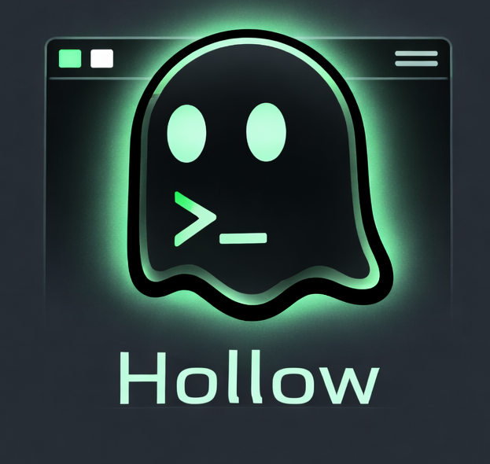

# Hollow Term

<div align="center">
    
</div>

Hollow is a Zig terminal emulator with a LuaJIT runtime and Ghostty's VT core.
The project is still early, but the current direction is already clear: native
rendering, Lua-configured behavior, and a widget-driven UI layer.

## What works now

- native build and launch via `./launch.sh`
- Lua config loading from `conf/init.lua` or the user config path
- tabs, split panes, workspaces, scrollback, selection, clipboard, and hyperlinks
- namespaced Lua API: `hollow.config`, `hollow.term`, `hollow.events`, `hollow.keys`, `hollow.ui`
- widget surfaces for topbar, sidebar, and overlay stacks
- optional sidebar reservation so the terminal can shrink around the sidebar instead of drawing under it
- LuaLS typings in `types/hollow.lua`

## Build

```bash
./launch.sh
./launch.sh --build-only
```

The Windows executable is emitted at `zig-out/bin/hollow-native.exe`.

## Config model

Hollow now uses the namespaced API directly:

```lua
local hollow = require("hollow")

hollow.config.set({
    backend = "sokol",
    shell = "pwsh.exe",
    cols = 120,
    rows = 34,
    scrollback = 64_000_000,
})

hollow.ui.topbar.mount(hollow.ui.topbar.new({
    render = function(ctx)
        return {
            hollow.ui.span(ctx.term.pane.cwd or "", { fg = "#dcd7ba" }),
            hollow.ui.spacer(),
            hollow.ui.span(hollow.strftime("%H:%M:%S"), { fg = "#7e9cd8" }),
        }
    end,
}))

hollow.keys.bind({
    {
        mods = "CTRL|SHIFT",
        key = "n",
        action = hollow.term.new_tab,
    },
})
```

## UI widgets

Widgets use shared primitives:

- `hollow.ui.span(text, style?)`
- `hollow.ui.spacer()`
- `hollow.ui.icon(name, style?)`
- `hollow.ui.group(children, style?)`

Available surfaces:

- `hollow.ui.topbar`
- `hollow.ui.sidebar`
- `hollow.ui.overlay`
- `hollow.ui.notify`
- `hollow.ui.input`
- `hollow.ui.select`

Sidebar reservation is opt-in:

```lua
hollow.ui.sidebar.mount(hollow.ui.sidebar.new({
    side = "left",
    width = 28,
    reserve = true,
    render = function(ctx)
        return {
            { hollow.ui.span("tabs", { bold = true }) },
            { hollow.ui.span("active: " .. ctx.term.tab.title) },
        }
    end,
}))
```

When `reserve = true`, Hollow reduces the terminal layout width to make room for
the sidebar. When the sidebar is hidden or unmounted, that space is released.

## Docs and typings

- API reference: `hollow-lua-api.md`
- LuaLS typings: `types/hollow.lua`
- default example config: `conf/init.lua`

## Notes

- `require("hollow")` returns the injected global runtime table.
- The old flat Lua API has been removed from the default config surface.
- `hollow.htp` and `hollow.process` still exist as planned namespaces, but are not fully implemented yet.
