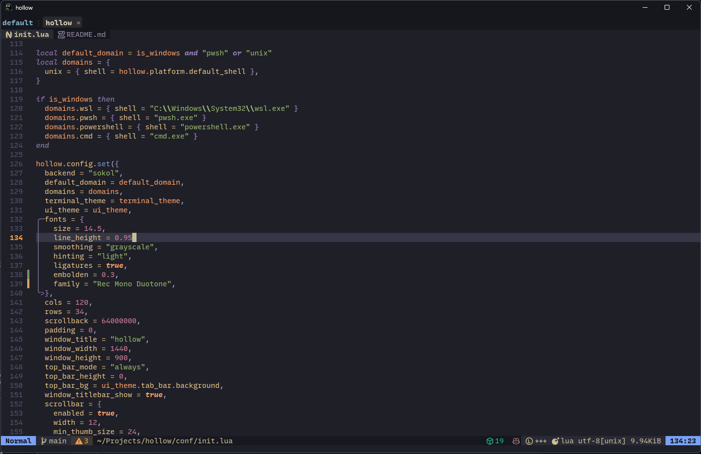
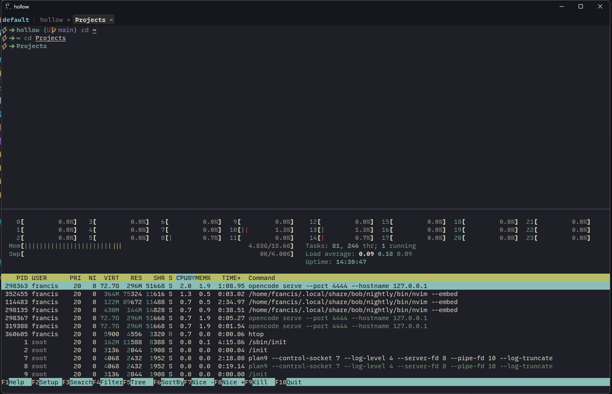

# Hollow

<div align="center">
    
</div>

<div align="center">
    
    
</div>

## What Hollow Is

A Zig terminal emulator with a LuaJIT runtime and Ghostty's VT core. A personal
project first — built for my own workflow — but designed to be useful and
customizable for others. A spiritual successor to
[WezTerm](https://wezfurlong.org/wezterm/), with Lua API inspiration from
Neovim.

If you are new to the repo, start with [the docs index](docs/README.md).

## Features

- Zig + LuaJIT runtime with a full Lua API (`hollow.config`, `hollow.term`,
  `hollow.events`, `hollow.keymap`, `hollow.ui`, `hollow.htp`, and more)
- Ghostty's VT core for fast, accurate terminal emulation
- Tabs, split panes, floating panes, maximized panes, workspaces, customizable top bar
- Scrollback, selection, clipboard, hyperlink handling, font discovery, ligature, nerd fonts and emoji support
- Basic support for Kitty images and Sixel
- Windows domains for `pwsh`, `powershell`, `cmd`, and `wsl`
- Optional WSL PTY bypass helper with automatic ConPTY fallback (needed for full escape sequence support)
- Cross-platform targets: Windows, WSL (primary); Linux, macOS (planned)
- Plugin system with Lua API for custom panes, overlays, and widgets (`hollow.plugins`)
- Opiniated default UX but fully customizable via Lua config and plugins

## Quick Start

**Zig version:** `0.15.2` only. If you use `asdf` or `mise`, run
`asdf install` or `mise install` from the repo root — `.tool-versions` is
already pinned.

**Download a release:** [github.com/sudo-tee/hollow/releases](https://github.com/sudo-tee/hollow/releases)
Windows builds include the optional `hollow-wsl-bypass` helper for WSL domains
(falls back to ConPTY automatically when the helper is absent).

**Customize:** copy `conf/init.lua` to `%APPDATA%\hollow\init.lua` (Windows) or
`~/.config/hollow/init.lua` (other).

**Build from source:**

```
./scripts/setup.sh        # first-time submodule init
./launch.sh               # Windows cross-build + run
zig build run             # non-Windows build + run
```

Full build docs in [Development](docs/development.md).

## Documentation

The full guide set lives in [`docs/`](docs/README.md):

| Section   | Start here                                                                                                                                                                     |
| --------- | ------------------------------------------------------------------------------------------------------------------------------------------------------------------------------ |
| Guides    | [Getting started](docs/getting-started.md), [Configuration](docs/configuration.md), [Keybindings](docs/keybindings.md), [Panes/tabs/workspaces](docs/panes-tabs-workspaces.md) |
| Platforms | [Windows](docs/platforms/windows.md), [WSL](docs/platforms/wsl.md), [Linux](docs/platforms/linux.md), [macOS](docs/platforms/macos.md)                                         |
| Reference | [Lua API](docs/reference/lua/README.md), [CLI](docs/reference/cli/native.md), [Keymap actions](docs/reference/actions.md)                                                      |
| Examples  | [Config snippets](docs/examples/config-snippets.md), [UI recipes](docs/examples/ui-recipes.md), [Plugin authoring](docs/examples/plugin-authoring.md)                          |

Companion files: [`conf/init.lua`](conf/init.lua) (default config),
[`types/hollow.lua`](types/hollow.lua) (LuaLS typings).

## Default Keymaps

All keymaps are defined in [`conf/init.lua`](conf/init.lua). The leader key is
`<C-Space>` (1200ms timeout). See the file for the full bindings or override
them in your user config via `hollow.keymap.set`.

## Project Status

- Hollow is still an active project and the API surface is still moving.
- The docs in this repo are meant to describe the current product, not a future roadmap.
- The current build is suitable for building, running, configuring, and packaging now, with Windows/WSL as the main tested target.
- If you are planning a docs site, treat [docs/README.md](docs/README.md) as the navigation root.
